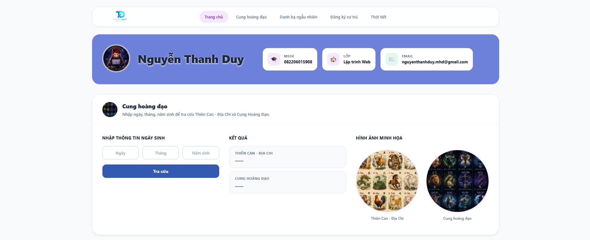
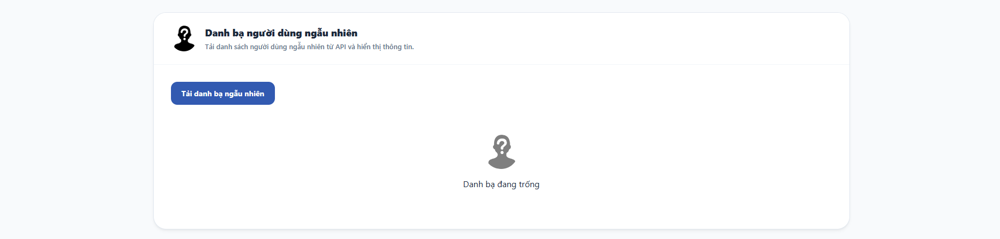
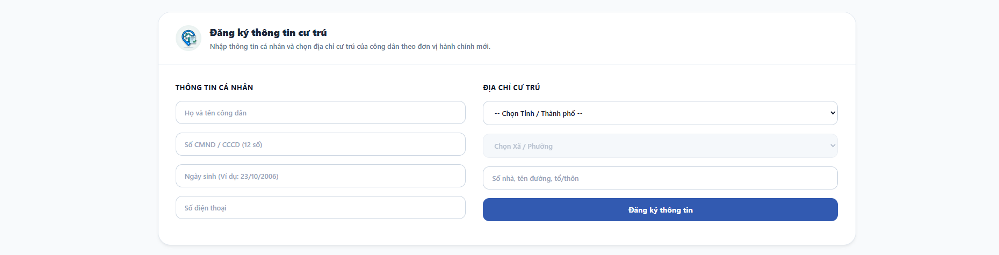
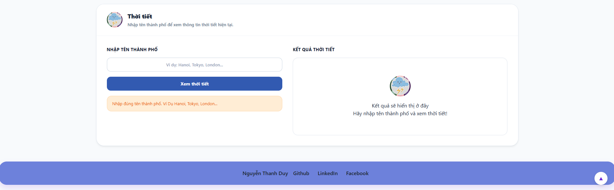

# 🌐 Website Tiện Ích Cá Nhân

Website cá nhân được xây dựng nhằm giới thiệu thông tin sinh viên và tích hợp một số tiện ích cơ bản như tra cứu cung hoàng đạo, tạo danh bạ ngẫu nhiên, đăng ký thông tin cư trú và xem thời tiết theo thành phố.

## 👤 Thông tin tác giả

- **Họ và tên:** Nguyễn Thanh Duy
- **Lớp:** Lập trình Web
- **Email:** nguyenthanhduy.mhd@gmail.com

## ✨ Chức năng chính

### ♈ Tra cứu cung hoàng đạo

Người dùng nhập ngày, tháng và năm sinh để:

- Xác định Thiên Can - Địa Chi.
- Xác định cung hoàng đạo.
- Hiển thị kết quả trực quan và dễ theo dõi.

### 👥 Danh bạ người dùng ngẫu nhiên

- Lấy dữ liệu người dùng từ API.
- Hiển thị thông tin danh bạ ngẫu nhiên.
- Giúp thực hành xử lý dữ liệu bất đồng bộ và làm việc với API.

### 🏠 Đăng ký thông tin cư trú

Biểu mẫu cho phép nhập:

- Họ và tên công dân.
- Số CMND/CCCD.
- Ngày sinh.
- Số điện thoại.
- Tỉnh/Thành phố.
- Xã/Phường.
- Địa chỉ chi tiết.

Dữ liệu được kiểm tra trước khi gửi nhằm hạn chế thông tin thiếu hoặc không hợp lệ.

### 🌦️ Tra cứu thời tiết

- Nhập tên thành phố để xem thông tin thời tiết hiện tại.
- Lấy dữ liệu từ API thời tiết.
- Hiển thị trạng thái, nhiệt độ và các thông tin liên quan.
- Thông báo khi tên thành phố không hợp lệ hoặc không tìm thấy dữ liệu.

## 🖼️ Giao diện

Giao diện được thiết kế theo phong cách hiện đại, đơn giản và dễ sử dụng:

- Màu sắc đồng bộ.
- Bố cục dạng thẻ rõ ràng.
- Thanh điều hướng thuận tiện.
- Biểu mẫu trực quan.
- Tương thích với nhiều kích thước màn hình.

> Có thể lưu ảnh minh họa vào thư mục `docs/images` và sử dụng cấu trúc bên dưới.

```text
docs/
└── images/
    ├── home.png
    ├── random-user.png
    ├── residence.png
    └── weather.png
```

### Trang chủ và tra cứu cung hoàng đạo



### Danh bạ ngẫu nhiên



### Đăng ký cư trú



### Tra cứu thời tiết



## 🛠️ Công nghệ sử dụng

- **HTML:** Xây dựng cấu trúc trang web.
- **CSS:** Thiết kế giao diện và bố cục.
- **JavaScript:** Xử lý sự kiện, kiểm tra biểu mẫu và gọi API.
- **REST API:** Lấy dữ liệu người dùng ngẫu nhiên và thông tin thời tiết.
- **Responsive Design:** Tối ưu hiển thị trên máy tính và thiết bị di động.

## 📁 Cấu trúc thư mục tham khảo

```text
project/
├── index.html
├── css/
│   ├── style.css
│   └── responsive.css
├── js/
│   ├── main.js
│   ├── zodiac.js
│   ├── random-user.js
│   ├── residence.js
│   └── weather.js
├── assets/
│   ├── images/
│   └── icons/
├── docs/
│   └── images/
└── README.md
```
## 🎯 Mục tiêu dự án

Dự án được thực hiện nhằm:

- Rèn luyện kỹ năng xây dựng giao diện web.
- Thực hành JavaScript và xử lý sự kiện.
- Làm quen với việc gọi và xử lý dữ liệu từ API.
- Kiểm tra dữ liệu biểu mẫu phía người dùng.
- Tổ chức mã nguồn rõ ràng và dễ bảo trì.

## 🔮 Hướng phát triển

- Thêm chế độ sáng/tối.
- Lưu danh bạ bằng Local Storage.
- Lưu lịch sử tra cứu thời tiết.
- Bổ sung xác thực và quản lý người dùng.
- Kết nối cơ sở dữ liệu cho chức năng đăng ký cư trú.
- Cải thiện khả năng hiển thị trên thiết bị di động.

## 📬 Liên hệ

- **Tác giả:** Nguyễn Thanh Duy
- **Email:** nguyenthanhduy.mhd@gmail.com
- **GitHub:** Thêm đường dẫn GitHub tại đây.
- **LinkedIn:** Thêm đường dẫn LinkedIn tại đây.
- **Facebook:** Thêm đường dẫn Facebook tại đây.

---

⭐ Nếu thấy dự án hữu ích, hãy để lại một lượt **Star** cho repository.
